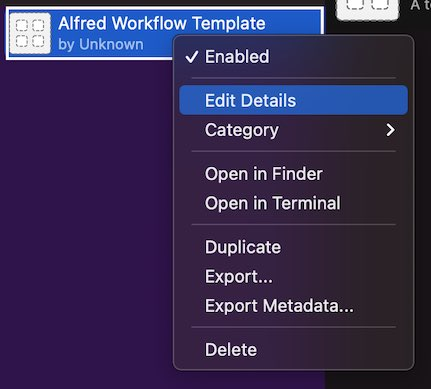

# Alfred Make Template

This is a template for new workflows for the [Alfred app][] for macOS. 

It comes with a [Makefile]() that contains to help you develop your workflow or create a deployable `.alfredworkflow` file.

It is fairly simple, but I plan on using it as a root for other templates.

[Alfred app]: https://alfredapp.com/

# Using this template

## Forking

First, create a repo from this template. This will allow you to create a repo on your GitHub account for your new workflow.

Then, clone your repo:

```sh
git clone https://github.com/yourusername/yourreponame
```

## Developing

### 1. Calling de-template

There are some files that are specific to the template repo, and aren't needed in forked workflows. To remove them, call [scripts/de-template]():

```sh
scripts/detemplate
```

### 2. Update Makefile

Update the top of the `Makefile` in any text editor and change the name, and include any files you've added that your workflow needs to run.

For example, if you plan on including `search.py` in your script, you can include that in the workflow by changing the `WORKFLOW_FILES` line:

```
# In Makefile
WORKFLOW_FILES = info.plist serach.py icon.png
```

### 3. Install a development version of the workflow to Alfred

Then, create a **development version** of the workflow with this command:

```sh
make install-dev
```

This action creates symbolic links in the workflow that point back to your cloned repo, and installs a workflow with those links. This means that any changes to the workflow show up in your git repo, and vice versa.

Make sure to right click the installed workflow and change the values:



Any changes you make to the workflow in Alfred will apply to the [info.plist]() file in your repo for you to commit and push to GitHub. If you add any files to the repository, update `WORKFLOW_FILES` in your Makefile again and call `make clean && make install-dev` again.

## Deploying

The development version of the workflow **cannot** be shared with others, as it will very likely not work. It relies on all of the key files living in the same location as you have them stored on your computer.

Instead, you need to create a **production version** of the workflow:

```sh
make clean
make workflow
```

You should test that everything in your workflow still works as intended by installing this version:

```sh
make install
```

As long as you haven't changed the bundle ID, the existing version will be replaced with this version. You can then test the functionality to make sure there is no change in behavior using actual files instead of links.

Once this is done, you can take the `.alfredworkflow` file that was created and publish it on GitHub, Packal, or some other platform.